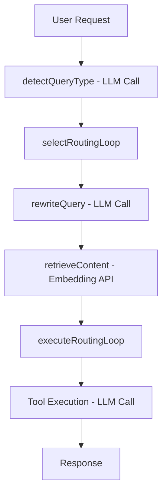

# Ellen Orchestrator Design Document
**Version**: 1.0  
**Date**: September 6, 2025  
**Status**: Active Development

## Executive Summary

The Ellen Orchestrator is the central routing and execution engine that processes user requests through appropriate pedagogical tools. This document outlines the current architecture, rationale for design decisions, and critical optimizations needed for scalability and cost efficiency.

## Table of Contents
1. [Current Architecture](#current-architecture)
2. [Design Rationale](#design-rationale)
3. [Performance Analysis](#performance-analysis)
4. [Proposed Optimizations](#proposed-optimizations)
5. [Future Considerations](#future-considerations)
6. [Tool Sequencing Patterns](#tool-sequencing-patterns)
7. [Cost Projections](#cost-projections)

## Current Architecture

### Request Flow (As of Sep 6, 2025)



### Current Implementation Details

#### 1. Query Classification (`detectQueryType`)
- **Method**: LLM call using GPT-4o-mini
- **Purpose**: Categorize into learning/coaching/planning/reflection/growth
- **Cost**: ~$0.0001 per call
- **Latency**: ~1-2 seconds
- **Issue**: Using LLM for what could be partially pattern-based

#### 2. Tool Selection (`selectRoutingLoop`)
- **Method**: Recently optimized from 5-tool chain to single tool selection
- **Purpose**: Choose appropriate tool based on query type and content
- **Cost**: No additional cost (uses detectQueryType result)
- **Latency**: <10ms
- **Status**: ✅ Recently fixed (was running 5 tools sequentially)

#### 3. Context Rewriting (`rewriteQuery`)
- **Method**: LLM call using GPT-4o-mini
- **Purpose**: Make queries self-contained for retrieval
- **Cost**: ~$0.0001 per call
- **Latency**: ~1-2 seconds
- **Issue**: Runs even when no context exists

#### 4. Vector Retrieval (`retrieveContent`)
- **Method**: Voyage AI embedding + Pinecone search
- **Purpose**: Fetch relevant educational content
- **Cost**: ~$0.0002 per query
- **Latency**: ~2-3 seconds
- **Issue**: Runs for all tools, even those that don't need it

#### 5. Tool Execution
- **Method**: Tool-specific LLM call
- **Purpose**: Generate pedagogical response
- **Cost**: $0.0002-0.002 depending on model tier
- **Latency**: 3-10 seconds depending on complexity

### Total Per Request
- **Minimum LLM Calls**: 3 (detect, rewrite, execute)
- **Average Latency**: 15-20 seconds
- **Average Cost**: $0.0005-0.0025

## Design Rationale

### Why Multiple LLM Calls?

1. **Separation of Concerns**: Each step has a distinct purpose
2. **Model Optimization**: Can use smaller models for classification
3. **Flexibility**: Easy to modify individual steps
4. **Debugging**: Clear pipeline for troubleshooting

### Why Context Rewriting?

1. **Vector Search Quality**: "Tell me more about that" won't match vectors
2. **Tool Flexibility**: Tools can assume self-contained queries
3. **Session Resilience**: Can recover context if session is lost

### Why Always Retrieve?

Initial assumption that all educational responses need content grounding. This is **incorrect** for process-focused tools.

## Performance Analysis

### Current Bottlenecks

1. **Unnecessary LLM Calls**
   - Context rewriting when no context exists (30% of requests)
   - Query classification could be partially keyword-based

2. **Unnecessary Retrieval**
   - Process tools (reflection, planning) don't need content
   - Writing tools work on user-provided content
   - ~40% of retrievals are unused

3. **Model Tier Misalignment**
   - Using same tier for all tools
   - Simple tools could use smaller models

### Cost Breakdown (per 1000 requests)

| Component | Calls | Unit Cost | Total Cost |
|-----------|-------|-----------|------------|
| Query Classification | 1000 | $0.0001 | $0.10 |
| Context Rewriting | 1000 | $0.0001 | $0.10 |
| Vector Retrieval | 1000 | $0.0002 | $0.20 |
| Tool Execution (avg) | 1000 | $0.001 | $1.00 |
| **Total** | | | **$1.40** |

## Immediate Implementation (This Sprint - Sep 6)

### 1. Tool Configuration Matrix
```typescript
const TOOL_CONFIG = {
  // Content tools - need retrieval
  socratic_tool: {
    needsRetrieval: true,
    contextStrategy: 'recent',  // Last 3 exchanges
    modelTier: 'S',
    category: 'pedagogical'
  },
  
  // Process tools - no retrieval needed
  reflection_tool: {
    needsRetrieval: false,
    contextStrategy: 'minimal',
    modelTier: 'S',
    category: 'pedagogical'
  },
  
  // Coaching tools - context critical
  writing_coach: {
    needsRetrieval: false,
    contextStrategy: 'full',  // Needs all revisions
    modelTier: 'M',  // Better model for nuanced feedback
    category: 'coaching'
  },
  
  // Planning tools
  plan_manager: {
    needsRetrieval: false,
    contextStrategy: 'goals',  // Just goals and constraints
    modelTier: 'S',
    category: 'planning'
  }
};
```

### 2. Context Compression Implementation

#### Compression Strategy
```typescript
class ContextManager {
  private readonly RECENT_MESSAGES = 6;  // Keep last 3 exchanges
  private readonly SUMMARY_THRESHOLD = 10;  // Summarize after 10 messages
  
  async getContext(strategy: ContextStrategy, sessionId: string): Promise<Message[]> {
    const messages = await this.sessionStorage.getMessages(sessionId);
    
    switch (strategy) {
      case 'none':
        return [];
        
      case 'minimal':
        return messages.slice(-2);  // Current exchange only
        
      case 'recent':
        return messages.slice(-this.RECENT_MESSAGES);
        
      case 'full':
        // For writing coach - keep all but compress if needed
        if (messages.length > this.SUMMARY_THRESHOLD) {
          return await this.compressContext(messages);
        }
        return messages;
        
      case 'summary':
        // Summarize old, keep recent
        if (messages.length > this.SUMMARY_THRESHOLD) {
          const summary = await this.summarizeOldContext(
            messages.slice(0, -this.RECENT_MESSAGES)
          );
          return [
            { role: 'system', content: `Previous context: ${summary}` },
            ...messages.slice(-this.RECENT_MESSAGES)
          ];
        }
        return messages;
        
      case 'goals':
        // Extract just learning goals and constraints
        return this.extractGoalsAndConstraints(messages);
        
      default:
        return messages.slice(-this.RECENT_MESSAGES);
    }
  }
  
  private async summarizeOldContext(messages: Message[]): Promise<string> {
    // Use small model to create concise summary
    const { text } = await generateText({
      model: gpt4oMini,
      system: 'Summarize this learning conversation in 2-3 sentences, focusing on topics covered and key insights.',
      messages: messages,
      temperature: 0.3,
      max_tokens: 150
    });
    return text;
  }
  
  private async compressContext(messages: Message[]): Promise<Message[]> {
    // For writing coach - keep structure but compress content
    const compressed = [];
    
    // Keep first message (original text)
    compressed.push(messages[0]);
    
    // Compress middle messages into revision summary
    if (messages.length > 4) {
      const middleMessages = messages.slice(1, -3);
      const summary = await this.summarizeRevisions(middleMessages);
      compressed.push({
        role: 'system',
        content: `Previous revisions: ${summary}`
      });
    }
    
    // Keep recent messages in full
    compressed.push(...messages.slice(-3));
    
    return compressed;
  }
}
```

### 3. Conditional Operations

```typescript
async processRequest(request: EllenRequest): Promise<EllenResponse> {
  // Store for tool selection
  this.currentRequest = request;
  
  // 1. Detect and select tool in one call (future optimization)
  const queryType = await this.detectQueryType(request);
  const tool = this.selectBestToolForQuery(queryType, request.message);
  
  // 2. Get tool configuration
  const config = TOOL_CONFIG[tool];
  
  // 3. Get appropriate context based on tool needs
  const contextManager = new ContextManager();
  const context = await contextManager.getContext(
    config.contextStrategy,
    request.context?.sessionId
  );
  
  // 4. Only rewrite if needed
  let processedQuery = request.message;
  if (config.needsRetrieval && context.length > 0) {
    processedQuery = await this.rewriteQuery(request, context);
  }
  
  // 5. Only retrieve if needed
  let retrievalResults = [];
  if (config.needsRetrieval) {
    retrievalResults = await this.retrieveContent(processedQuery, queryType);
  }
  
  // 6. Execute with appropriate model tier
  const result = await this.executeTool(tool, {
    message: request.message,
    context: context,
    retrieval: retrievalResults,
    modelTier: config.modelTier
  });
  
  return result;
}
```

### 4. Token Usage Tracking

```typescript
interface TokenMetrics {
  contextTokens: number;
  promptTokens: number;
  completionTokens: number;
  totalCost: number;
}

class TokenTracker {
  track(request: any, response: any, model: string): TokenMetrics {
    const contextTokens = this.countTokens(request.context);
    const promptTokens = this.countTokens(request.prompt);
    const completionTokens = this.countTokens(response.text);
    
    const costs = {
      'gpt-4o-mini': { input: 0.00015, output: 0.0006 },
      'gpt-4o': { input: 0.005, output: 0.015 },
      'claude-3-haiku': { input: 0.00025, output: 0.00125 }
    };
    
    const modelCost = costs[model];
    const totalCost = (
      (contextTokens + promptTokens) * modelCost.input / 1000 +
      completionTokens * modelCost.output / 1000
    );
    
    return {
      contextTokens,
      promptTokens,
      completionTokens,
      totalCost
    };
  }
}
```

## Expected Impact

### With ALL Optimizations (Including Context Compression)

| Optimization | Impact | Cost Reduction |
|--------------|--------|----------------|
| Skip unnecessary rewriting | -30% of rewrite calls | $0.03/1000 requests |
| Skip retrieval for process tools | -40% of retrievals | $0.08/1000 requests |
| Context compression | -60% token usage for long convos | $0.20/1000 requests |
| Tool-specific model tiers | -20% on simple tools | $0.10/1000 requests |
| **Total** | | **$0.41/1000 requests (29% reduction)** |

### Long Conversation Impact

For a 20-turn conversation:
- **Without compression**: ~8,000 tokens of context
- **With compression**: ~2,000 tokens (summary + recent)
- **Cost savings**: $0.006 per long conversation

## Future Considerations

### Planned Tools (Post-Launch)

1. **Integrated Writing Tutor**
   - Challenge: Managing large document context efficiently
   - Solution: Document diffing + change-focused prompts
   - Context Strategy: 'document' type with smart windowing

2. **Collaborative Tools**
   - Peer review facilitator
   - Group study coordinator
   - Discussion moderator

3. **Specialized Domain Tools**
   - Math solver with step validation
   - Code tutor with execution
   - Language practice with pronunciation

### Tool Sequencing Patterns

As we add more tools, common sequences will emerge:

#### Learning Sequence
```
socratic_tool → extension_tool → retrieval → reflection_tool
```

#### Writing Process Sequence
```
brainstorm_tool → outline_tool → writing_coach → revision_tool
```

#### Study Session Sequence
```
focus_session → content_tool → retrieval → reflection_tool
```

### Implementation Strategy
```typescript
const TOOL_SEQUENCES = {
  'deep_learning': ['socratic_tool', 'extension_tool', 'reflection_tool'],
  'writing_process': ['brainstorm_tool', 'writing_coach', 'revision_tool'],
  'exam_prep': ['plan_manager', 'retrieval', 'flashcard_generator']
};

// Detect if user is in a sequence
if (isInSequence(conversationHistory)) {
  suggestNextTool(sequence, currentPosition);
}
```

## Cost Projections

### Current State (Unoptimized)
- **Per Request**: $0.0014
- **Per User Session (20 requests)**: $0.028
- **1000 Daily Active Users**: $28/day = $840/month

### With All Optimizations (Including Context Compression)
- **Per Request**: $0.0006 (57% reduction)
- **Per User Session**: $0.012
- **1000 Daily Active Users**: $12/day = $360/month
- **Long conversations (30+ turns)**: Additional 40% savings

### Integrated Writing Tutor Projections
With context compression:
- **Initial analysis**: $0.01
- **Per revision**: $0.001 (with diff-based updates)
- **Full session (20 revisions)**: $0.03 (vs $0.05 uncompressed)

## Monitoring & Metrics

### Key Metrics to Track

1. **Performance Metrics**
   - Average latency per tool
   - LLM calls per request
   - Cache hit rates
   - Context compression ratio

2. **Usage Patterns**
   - Tool selection distribution
   - Tool sequence patterns
   - Context length distribution
   - Conversation length distribution

3. **Cost Metrics**
   - Cost per request by tool
   - Token usage by component
   - Retrieval usage rate
   - Compression savings

### Implementation
```typescript
class OrchestrationMetrics {
  track(request: EllenRequest, response: EllenResponse) {
    metrics.record({
      tool: response.toolsUsed,
      latency: response.timestamp - request.timestamp,
      llmCalls: response.llmCallCount,
      tokensUsed: response.totalTokens,
      contextTokens: response.contextTokens,
      compressionRatio: response.compressionRatio,
      retrievalUsed: response.hadRetrieval,
      contextLength: request.context?.priorTurns?.length || 0
    });
  }
}
```

## Implementation Priority

### Immediate (This Sprint - Sep 6)
1. ✅ Fix routing loop (DONE - reduced from 5 to 1 tool)
2. 🔄 Implement tool configuration matrix
3. 🔄 Add conditional context rewriting
4. 🔄 Skip retrieval for process tools
5. 🔄 Implement context compression

### Next Sprint
1. Combined classification + selection
2. Monitoring implementation
3. Tool sequencing patterns

### Future Sprints
1. Streaming responses
2. Writing tutor optimization
3. Advanced compression strategies

## Risk Mitigation

### Risks of Optimization

1. **Over-compression**: Might lose important context
   - Mitigation: Tool-specific compression strategies
   - Mitigation: Keep critical messages (first, recent)
   
2. **Context Loss**: Summary might miss nuance
   - Mitigation: Adjustable compression thresholds
   - Mitigation: Full context for writing tools
   
3. **Increased Complexity**: Harder to debug
   - Mitigation: Comprehensive logging
   - Mitigation: Compression metrics tracking

## Conclusion

The orchestrator is functional but inefficient. With proposed optimizations including context compression, we can:
- Reduce costs by 57% (up to 70% for long conversations)
- Reduce latency by 40%
- Enable cost-effective scaling
- Support complex tools like the integrated writing tutor
- Handle 30+ turn conversations efficiently

The key insight: **Different tools have different needs**. A one-size-fits-all pipeline wastes resources. Tool-specific optimization paths with smart context management will make Mookti economically viable at scale.

---

*Next Steps*: Implement all Phase 1 optimizations including context compression and establish monitoring baseline.