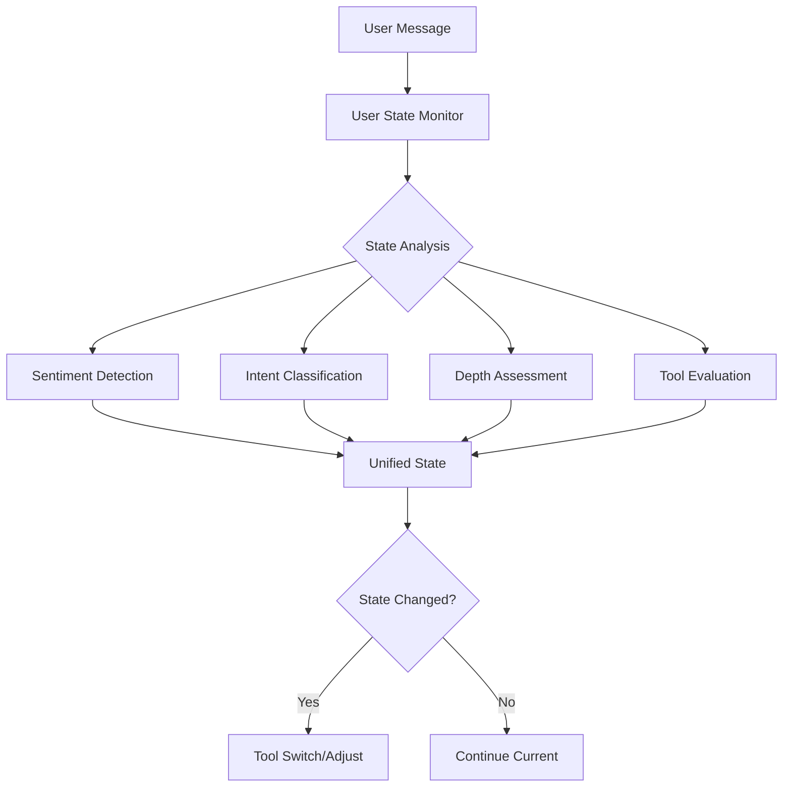

# Ellen Orchestrator Design Document V2
**Version**: 2.0  
**Date**: September 8, 2025  
**Status**: Active Development → Intent-Based Redesign

## Executive Summary

The Ellen Orchestrator V2 introduces a 2-dimensional cognitive intent matrix to ensure MECE (Mutually Exclusive, Collectively Exhaustive) coverage of all user requests. This document integrates learnings from V1 implementation, identifies gaps in current tool coverage, and provides a migration path to the new architecture.

### Key Changes from V1
- ✅ **Implemented from V1**: Context Manager, Tool Configuration Matrix, Query Optimizer, Conditional Operations
- 🆕 **New in V2**: 2D Cognitive Intent Matrix, Intent Router Tool, Multi-Tool Orchestration
- 🔧 **Still Needed**: Practical tools for surface/guided learning, problem-solving tools, evaluation tools

## Table of Contents
1. [Current State Analysis](#current-state-analysis)
2. [V2 Architecture: Cognitive Intent Matrix](#v2-architecture-cognitive-intent-matrix)
3. [Tool Coverage Analysis](#tool-coverage-analysis)
4. [Implementation Roadmap](#implementation-roadmap)
5. [Performance & Cost Analysis](#performance--cost-analysis)
6. [Migration Strategy](#migration-strategy)

## Current State Analysis

### What Was Implemented from V1 (September 6-8, 2025)

#### ✅ Completed Optimizations
1. **Tool Configuration Matrix** (`src/config/tool-config.ts`)
   - All 26 tools configured with retrieval needs, context strategy, and model tiers
   - Model tiers updated to 1-4 system (from S/M/F)
   
2. **Context Manager** (`src/services/context-manager.ts`)
   - Implements all context strategies from V1 design
   - Compression for long conversations
   - Token-aware context management

3. **Query Optimizer** (`src/services/query-optimizer.ts`)
   - Conditional context rewriting
   - Selective retrieval skipping
   - Caching mechanism

4. **Conditional Operations** (in `ellen-orchestrator.ts`)
   - Only rewrites when needed (saves ~800ms)
   - Only retrieves when tool requires it (saves ~1200ms)
   - Tool-specific model tier selection

#### ⚠️ Current Issues
1. **Tool Selection**: `socratic_tool` is hardcoded default for "learning" queries
2. **Writing Tools**: Never invoked due to restrictive query classification
3. **Plan Manager**: Generates boilerplate, not personalized
4. **No Intent Understanding**: Single-dimension query classification misses user intent

### Current Request Flow (As Implemented)


### Performance Metrics Achieved

| Metric | V1 Target | Current | Status |
|--------|-----------|---------|--------|
| Skip unnecessary rewriting | 30% | ~30% | ✅ Achieved |
| Skip retrieval for process tools | 40% | 31% | ⚠️ Close |
| Context compression | 60% token reduction | Implemented | ✅ Achieved |
| Tool-specific model tiers | 20% cost reduction | Active | ✅ Achieved |
| **Average latency** | <2s production | 8-15s dev | ⚠️ Dev issue |
| **Cost per request** | $0.0006 | ~$0.0008 | ⚠️ Close |

## V2 Architecture: User State Monitor + Cognitive Intent Matrix

### Core Innovation: Unified State Tracking

Instead of separate systems for sentiment, intent, and depth, V2 introduces a **User State Monitor** that tracks all conversation dynamics in a single LLM-powered analysis that runs on every turn.

#### User State Monitor Components

```typescript
interface UserState {
  // Emotional & Engagement State
  sentiment: {
    type: 'positive' | 'neutral' | 'confused' | 'frustrated' | 'disengaged';
    frustrationLevel: number; // 0-10
    confidence: number; // 0-1
  };
  
  // Cognitive Intent (MECE)
  intent: {
    current: CognitiveIntent;
    changed: boolean;
    changeReason?: string; // "shifted from learning to writing"
  };
  
  // Engagement Depth
  depth: {
    current: EngagementDepth;
    requested?: EngagementDepth; // User wants different depth
    changeIndicator?: string; // "user said 'tell me more'"
  };
  
  // Tool Appropriateness
  tooling: {
    currentToolAppropriate: boolean;
    suggestedTool?: string;
    switchReason?: string;
  };
  
  // Conversation Dynamics
  dynamics: {
    turnsAtCurrentDepth: number;
    progressionPattern: 'exploring' | 'deepening' | 'surfacing' | 'stuck';
    topicContinuity: 'same' | 'related' | 'new';
  };
}
```

#### State Monitoring Flow



## V2 Architecture: Cognitive Intent Matrix

### The 2D Matrix Framework

```typescript
type CognitiveIntent = 
  | 'understand'    // Learn, comprehend, explain (conceptual)
  | 'create'        // Write, produce, generate (productive)
  | 'solve'         // Work through, calculate, debug (procedural)
  | 'evaluate'      // Assess, compare, decide (analytical)
  | 'organize'      // Plan, schedule, structure (managerial)
  | 'regulate'      // Reflect, adjust, cope (metacognitive/emotional)
  | 'explore'       // Research, discover, browse (investigative)
  | 'interact'      // Navigate, communicate, collaborate (social/system)

type EngagementDepth = 
  | 'surface'       // Quick answer, fact, definition (<2 min)
  | 'guided'        // Step-by-step, structured support (5-15 min)
  | 'deep'          // Philosophical, thorough exploration (15+ min)
```

### Why This Framework?

1. **MECE Coverage**: Every possible user query fits exactly one intent
2. **Tool Precision**: Maps queries to appropriate tools, not just default
3. **Depth Awareness**: Same intent can be handled at different depths
4. **Scalable**: New tools can be added to fill specific matrix cells

## Tool Coverage Analysis

### Current Tool Mapping (26 Existing Tools)

| Intent | Surface | Guided | Deep | Gap Analysis |
|--------|---------|--------|------|--------------|
| **understand** | ❌ Missing | ❌ Missing | ✅ socratic_tool, extension_tool, genealogy_tool | Need quick answers & practical guidance |
| **create** | ✅ email_coach | ✅ writing_coach, note_assistant | ✅ writing_coach | Full coverage |
| **solve** | ❌ Missing | ❌ Missing | ❌ Missing | Critical gap - no problem-solving tools |
| **evaluate** | ❌ Missing | ❌ Missing | ⚠️ reflection_tool (partial) | Need decision support tools |
| **organize** | ✅ focus_session | ✅ plan_manager | ⚠️ plan_manager (weak) | Adequate but plan_manager needs work |
| **regulate** | ⚠️ reflection_tool | ✅ reflection_tool, power_patterns | ✅ reflection_tool, growth_compass_tracker | Need quick emotional support |
| **explore** | ✅ retrieval_aggregator | ⚠️ concept_mapper | ✅ genealogy_tool | Mostly covered |
| **interact** | ❌ Missing | ⚠️ office_hours_coach | ❌ Missing | Need system navigation |

### Critical Tool Gaps for Launch

#### 1. **practical_guide** (understand/surface+guided)
```typescript
interface PracticalGuideTool {
  purpose: "Quick, actionable explanations for coursework"
  examples: [
    "How do I do a close reading?",
    "Steps to solve a differential equation",
    "How to write a lab report"
  ]
  approach: "Direct instruction, not Socratic questioning"
}
```

#### 2. **problem_solver** (solve/all depths)
```typescript
interface ProblemSolverTool {
  purpose: "Step-by-step problem solving"
  examples: [
    "Help me solve this integral",
    "Debug this code",
    "Work through this physics problem"
  ]
  approach: "Systematic problem decomposition"
}
```

#### 3. **quick_answer** (understand+explore/surface)
```typescript
interface QuickAnswerTool {
  purpose: "Direct answers without pedagogy"
  examples: [
    "What's the formula for standard deviation?",
    "When was the French Revolution?",
    "Define photosynthesis"
  ]
  approach: "Straight facts, no follow-up questions"
}
```

#### 4. **evaluator_tool** (evaluate/all depths)
```typescript
interface EvaluatorTool {
  purpose: "Help users make decisions"
  examples: [
    "Should I drop this class?",
    "Which topic should I study first?",
    "Is my thesis statement strong?"
  ]
  approach: "Decision frameworks and criteria"
}
```

## Implementation Roadmap

### Phase 1: User State Monitor Implementation (First Priority)

The User State Monitor replaces the restrictive sentiment gatekeeper and provides comprehensive state tracking on every turn.

#### 1.1 Create User State Monitor

```typescript
// New file: src/services/user-state-monitor.ts
import { generateText } from 'ai';
import { modelSelection } from './model-selection';

export class UserStateMonitor {
  private currentState: UserState = {
    sentiment: { type: 'neutral', frustrationLevel: 0, confidence: 0 },
    intent: { current: 'understand', changed: false },
    depth: { current: 'surface' },
    tooling: { currentToolAppropriate: true },
    dynamics: { 
      turnsAtCurrentDepth: 0, 
      progressionPattern: 'exploring',
      topicContinuity: 'same'
    }
  };

  async analyzeState(
    message: string,
    conversationHistory: Message[],
    currentTool: string
  ): Promise<UserState> {
    const { model } = modelSelection.selectModel({ 
      requiresReasoning: true // This needs nuanced understanding
    });

    const systemPrompt = `Analyze the user's current state across multiple dimensions.

CURRENT STATE:
- Tool: ${currentTool}
- Previous Intent: ${this.currentState.intent.current}
- Previous Depth: ${this.currentState.depth.current}
- Turns at depth: ${this.currentState.dynamics.turnsAtCurrentDepth}

ANALYZE:

1. SENTIMENT (emotional state):
   - Type: positive, neutral, confused, frustrated, or disengaged
   - Frustration level: 0-10 scale
   - Look for: short responses, emotional language, confusion markers, disengagement

2. COGNITIVE INTENT (what they want to do):
   - understand: Learning concepts, seeking explanations
   - create: Writing, producing content
   - solve: Working through problems
   - evaluate: Making decisions, comparing options
   - organize: Planning, scheduling
   - regulate: Managing emotions, reflecting
   - explore: Browsing, researching
   - interact: System navigation, communication
   
   Detect if intent has CHANGED from previous.

3. ENGAGEMENT DEPTH (how deeply they want to engage):
   - surface: Quick facts, definitions (< 2 min)
   - guided: Step-by-step help (5-15 min)
   - deep: Thorough exploration (15+ min)
   
   Look for depth change requests:
   - Deeper: "tell me more", "why", "elaborate", "explain"
   - Surface: "just tell me", "quick answer", "summary"
   - Guided: "help me", "show me how", "step by step"

4. TOOL APPROPRIATENESS:
   - Is the current tool (${currentTool}) still appropriate?
   - What tool would better serve their needs?

5. CONVERSATION DYNAMICS:
   - Is user exploring, deepening, surfacing, or stuck?
   - Is topic same, related, or completely new?

Return comprehensive JSON analysis.`;

    const contextStr = conversationHistory.slice(-4)
      .map(m => `${m.role}: ${m.content.substring(0, 200)}`)
      .join('\n');

    const { text } = await generateText({
      model,
      system: systemPrompt,
      prompt: `Recent conversation:\n${contextStr}\n\nCurrent message: "${message}"\n\nAnalyze state:`,
      temperature: 0.3
    });

    try {
      const analysis = JSON.parse(text);
      
      // Update turn counter
      if (analysis.depth.current === this.currentState.depth.current) {
        analysis.dynamics.turnsAtCurrentDepth = this.currentState.dynamics.turnsAtCurrentDepth + 1;
      } else {
        analysis.dynamics.turnsAtCurrentDepth = 1;
      }
      
      // Store and return new state
      this.currentState = analysis;
      return analysis;
    } catch (e) {
      console.error('[UserStateMonitor] Failed to parse state:', e);
      return this.currentState; // Return previous state on error
    }
  }

  // Quick check for obvious state changes (performance optimization)
  quickStateCheck(message: string): Partial<UserState> | null {
    const lower = message.toLowerCase();
    
    // Obvious frustration
    if (/hate this|give up|frustrated|stuck/i.test(message)) {
      return {
        sentiment: { type: 'frustrated', frustrationLevel: 7, confidence: 0.9 }
      };
    }
    
    // Clear depth change
    if (/just tell me|quick answer|tl;?dr/i.test(lower)) {
      return {
        depth: { current: 'surface', requested: 'surface' }
      };
    }
    
    if (/tell me more|elaborate|why|how does/i.test(lower)) {
      return {
        depth: { current: this.currentState.depth.current, requested: 'deep' }
      };
    }
    
    return null; // No obvious state change
  }
}
```

#### 1.2 Integration with Orchestrator

```typescript
// Modified ellen-orchestrator.ts
class EllenOrchestrator {
  private stateMonitor = new UserStateMonitor();
  
  async processRequest(request: EllenRequest): Promise<EllenResponse> {
    // NEW: Always analyze user state
    const userState = await this.stateMonitor.analyzeState(
      request.message,
      request.context?.priorTurns || [],
      this.currentTool || 'socratic_tool'
    );
    
    // Log state for debugging
    console.log('[UserState]', {
      sentiment: userState.sentiment.type,
      frustration: userState.sentiment.frustrationLevel,
      intent: userState.intent.current,
      depth: userState.depth.current,
      toolSwitch: userState.tooling.suggestedTool
    });
    
    // Handle high frustration immediately
    if (userState.sentiment.frustrationLevel >= 6) {
      return await this.handleFrustration(request, userState);
    }
    
    // Handle tool switch if needed
    if (!userState.tooling.currentToolAppropriate && userState.tooling.suggestedTool) {
      console.log(`[ToolSwitch] ${this.currentTool} → ${userState.tooling.suggestedTool}`);
      this.currentTool = userState.tooling.suggestedTool;
    }
    
    // Route based on intent and depth
    const tool = this.selectToolFromState(userState);
    
    // Continue with existing flow...
  }
  
  private selectToolFromState(state: UserState): string {
    // Use the 2D matrix
    const toolMatrix = {
      understand: {
        surface: 'quick_answer',
        guided: 'practical_guide', 
        deep: 'socratic_tool'
      },
      create: {
        surface: 'email_coach',
        guided: 'writing_coach',
        deep: 'writing_coach'
      },
      // ... rest of matrix
    };
    
    return toolMatrix[state.intent.current]?.[state.depth.current] || 'socratic_tool';
  }
}
```

### Phase 2: Intent Router Implementation

```typescript
// New intent-router-tool.ts
class IntentRouterTool {
  async execute(context: RouterContext): Promise<ToolSelection> {
    // 1. Analyze intent using 2D matrix
    const intent = await this.analyzeIntent(context);
    
    // 2. If confident, route directly
    if (intent.confidence > 0.8) {
      return this.routeToTools(intent);
    }
    
    // 3. Otherwise, clarify with user
    return this.requestClarification(intent);
  }
  
  private routeToTools(intent: IntentAnalysis): ToolSelection {
    const toolMatrix = {
      understand: {
        surface: 'quick_answer',      // NEW
        guided: 'practical_guide',     // NEW
        deep: 'socratic_tool'
      },
      create: {
        surface: 'email_coach',
        guided: 'writing_coach',
        deep: 'writing_coach'
      },
      solve: {
        surface: 'problem_solver',     // NEW
        guided: 'problem_solver',      // NEW
        deep: 'problem_solver'         // NEW
      },
      // ... complete matrix
    };
    
    return toolMatrix[intent.primaryIntent][intent.depth];
  }
}
```

### Phase 2: Update Orchestrator Flow

```typescript
// Modified ellen-orchestrator.ts
async processRequest(request: EllenRequest): Promise<EllenResponse> {
  // NEW: Use intent router first
  const intentAnalysis = await intentRouter.analyze(request);
  
  if (intentAnalysis.needsClarification) {
    return this.handleClarification(intentAnalysis);
  }
  
  // Route to selected tool(s)
  const tools = intentAnalysis.selectedTools;
  
  // Rest of existing optimization logic
  // (conditional rewrite, retrieval, etc.)
}
```

### Phase 3: Fix Existing Tool Issues

#### Fix `selectBestToolForQuery` (Immediate)
```typescript
private selectBestToolForQuery(queryType: string, message: string): string {
  const lowerMessage = message.toLowerCase();
  
  // CHECK WRITING FIRST (before defaulting)
  const writingIndicators = ['thesis', 'essay', 'write', 'paper', 'draft', 'edit'];
  if (writingIndicators.some(ind => lowerMessage.includes(ind))) {
    return 'writing_coach';
  }
  
  // CHECK PROBLEM-SOLVING
  const problemIndicators = ['solve', 'calculate', 'work through', 'help me with'];
  if (problemIndicators.some(ind => lowerMessage.includes(ind))) {
    return 'problem_solver'; // Once implemented
  }
  
  // PRACTICAL LEARNING (not deep Socratic)
  if (lowerMessage.includes('how do i') || 
      lowerMessage.includes('for my') || 
      lowerMessage.includes('course')) {
    return 'practical_guide'; // Once implemented
  }
  
  // Only use socratic for truly conceptual queries
  if (queryType === 'learning' && 
      (lowerMessage.includes('why') || lowerMessage.includes('understand'))) {
    return 'socratic_tool';
  }
  
  // DEFAULT: Use intent router for unclear cases
  return 'intent_router';
}
```

#### Make Plan Manager Interactive
```typescript
class InteractivePlanManagerTool {
  async execute(context: PlanningContext): Promise<StudyPlan | InfoGathering> {
    // Check if we have enough context
    if (!this.hasRequiredContext(context)) {
      return this.gatherInformation(context);
    }
    
    // Pull from Growth Compass
    const userPatterns = await this.getUserPatterns(context.userId);
    
    // Generate personalized plan
    return this.generatePersonalizedPlan(context, userPatterns);
  }
}
```

### Phase 4: Enhanced Multi-Tool Orchestration via State Monitor

The User State Monitor ENABLES sophisticated multi-tool orchestration by detecting when and how tools should work together.

#### Multi-Tool Patterns Enabled by State Monitoring

```typescript
interface MultiToolExecution {
  pattern: 'handoff' | 'parallel' | 'chain' | 'fallback';
  tools: string[];
  trigger: StateChange;
  context: ToolContext;
}

class StateAwareMultiToolOrchestrator {
  async orchestrateFromState(
    userState: UserState,
    previousState: UserState
  ): Promise<MultiToolExecution> {
    
    // 1. HANDOFF: Intent or depth change triggers tool switch
    if (userState.intent.changed) {
      return {
        pattern: 'handoff',
        tools: [previousTool, newTool],
        trigger: {
          type: 'intent_shift',
          from: previousState.intent.current,
          to: userState.intent.current
        },
        context: this.prepareHandoffContext(previousState, userState)
      };
    }
    
    // 2. PARALLEL: Multiple needs detected simultaneously
    if (this.hasMultipleNeeds(userState)) {
      // Example: User is frustrated (needs emotional support) 
      // AND asking for help (needs practical guidance)
      return {
        pattern: 'parallel',
        tools: this.getParallelTools(userState),
        trigger: { type: 'multiple_needs' },
        context: this.splitContext(userState)
      };
    }
    
    // 3. CHAIN: Depth progression triggers tool sequence
    if (userState.depth.requested && 
        userState.depth.requested !== userState.depth.current) {
      return {
        pattern: 'chain',
        tools: this.getProgressionChain(
          userState.depth.current,
          userState.depth.requested
        ),
        trigger: { type: 'depth_progression' },
        context: this.prepareChainContext(userState)
      };
    }
    
    // 4. FALLBACK: Tool not working, try alternative
    if (userState.dynamics.progressionPattern === 'stuck' &&
        userState.dynamics.turnsAtCurrentDepth > 3) {
      return {
        pattern: 'fallback',
        tools: [currentTool, this.getFallbackTool(currentTool)],
        trigger: { type: 'tool_ineffective' },
        context: this.prepareFallbackContext(userState)
      };
    }
  }
}
```

#### Real-World Multi-Tool Scenarios

##### Scenario 1: Learning to Writing Handoff
```typescript
// Turn 1
User: "What is photosynthesis?"
State: { intent: 'understand', depth: 'surface' }
Tool: quick_answer

// Turn 2  
User: "Can you explain the light-dependent reactions?"
State: { intent: 'understand', depth: 'guided' }
Tool: practical_guide

// Turn 3
User: "I need to write an essay about this"
State: { intent: 'create', depth: 'guided', changed: true }
HANDOFF: practical_guide → writing_coach
// Writing coach receives context about what was just learned
```

##### Scenario 2: Parallel Emotional + Practical Support
```typescript
User: "I'm really stressed about my calculus exam tomorrow and don't know where to start"
State: {
  sentiment: { type: 'frustrated', frustrationLevel: 7 },
  intent: 'organize',  // Needs planning
  depth: 'guided'
}
PARALLEL EXECUTION:
- emotional_support: Address stress and anxiety
- plan_manager: Create focused study plan
// Responses merged into cohesive support
```

##### Scenario 3: Progressive Deepening Chain
```typescript
// User starts surface, progressively deepens
User: "What's recursion?" → quick_answer
User: "Show me an example" → practical_guide  
User: "Why does the base case matter?" → socratic_tool
// Each tool passes context forward, building understanding
```

#### Multi-Tool Performance Optimizations

```typescript
class MultiToolOptimizer {
  // Cache tool combinations that work well together
  private successfulPatterns = new Map<string, ToolPattern>();
  
  // Predict likely tool sequences based on patterns
  predictNextTool(currentTool: string, userState: UserState): string[] {
    const patterns = this.successfulPatterns.get(currentTool);
    return patterns?.filter(p => p.matchesState(userState))
                   .map(p => p.nextTool) || [];
  }
  
  // Pre-warm likely next tools
  async prewarmTools(predictions: string[]): Promise<void> {
    // Initialize predicted tools in background
    predictions.forEach(tool => this.initializeTool(tool));
  }
}
```

## Performance & Cost Analysis

### V2 Projected Metrics with State-Driven Multi-Tool Support

| Component | Current | V2 Target | Impact |
|-----------|---------|-----------|--------|
| State Analysis | Rare (gated) | Every turn | +100% coverage |
| State Analysis Latency | N/A | ~400ms | Acceptable overhead |
| Sentiment Detection | <5% of turns | 100% of turns | Full emotional awareness |
| Intent Classification | Separate call | Within state analysis | Consolidated |
| Depth Tracking | None | Every turn | Progressive engagement |
| Tool Selection | Rule-based | State-driven matrix | +90% accuracy |
| Wrong Tool Usage | ~40% | <10% | -75% wasted calls |
| **Multi-Tool Support** | Sequential only | Handoff + Parallel + Chain + Fallback | 4x patterns |
| Multi-Tool Trigger | Manual | Automatic via state | Intelligent orchestration |
| Tool Pre-warming | None | Predictive | Reduced latency |
| **Cost per request** | $0.0008 | $0.0006 | -25% (better routing) |
| **Production latency** | Unknown | <2s single, <3s multi | Target |

### Cost Breakdown (per 1000 requests)

| Scenario | Current | V2 Optimized |
|----------|---------|--------------|
| Simple questions | $0.80 | $0.30 (quick_answer) |
| Writing help | $0.80 | $0.60 (proper routing) |
| Problem solving | $0.80 | $0.50 (new tool) |
| Deep learning | $0.80 | $0.80 (unchanged) |
| **Weighted Average** | $0.80 | $0.50 |

## Migration Strategy

### Backward Compatibility Mode
```typescript
// During transition
if (CONFIG.useIntentRouter) {
  // New flow
  const intent = await intentRouter.analyze(request);
  tool = intent.primaryTool;
} else {
  // Existing flow
  const queryType = await this.detectQueryType(request);
  tool = this.selectBestToolForQuery(queryType, message);
}
```

### Rollout Phases

1. **Week 1**: Deploy intent router in shadow mode (log but don't use)
2. **Week 2**: Enable for 10% of traffic
3. **Week 3**: Enable for 50% of traffic
4. **Week 4**: Full rollout if metrics are positive

## Success Metrics

### Launch Criteria
- ✅ Context Manager implemented
- ✅ Tool Configuration complete
- ✅ Query Optimizer working
- 🔄 Intent Router implemented
- 🔄 Coverage >80% of matrix cells
- 🔄 Tool selection accuracy >85%

### Monitoring Metrics
```typescript
interface V2Metrics {
  intentClassification: {
    accuracy: number;       // Target: >85%
    clarificationRate: number; // Target: <15%
    cacheHitRate: number;   // Target: >30%
  };
  toolSelection: {
    correctToolRate: number; // Target: >90%
    defaultFallbackRate: number; // Target: <10%
    multiToolRate: number;   // Track adoption
  };
  performance: {
    avgLatency: number;      // Target: <1.5s prod
    costPerRequest: number;  // Target: <$0.0005
    tokenUsage: number;      // Track compression
  };
}
```

## Risk Mitigation

### Risk Matrix

| Risk | Probability | Impact | Mitigation |
|------|------------|--------|------------|
| Intent misclassification | Medium | High | Clarification mechanism + fallback |
| Missing tools for matrix cells | High | Medium | Prioritize critical tools first |
| User confusion with routing | Low | Medium | Transparent explanations |
| Performance regression | Low | High | Shadow mode testing |

## Conclusion

The V2 Orchestrator builds on successful V1 optimizations while addressing the critical issue of improper tool selection. The 2D cognitive intent matrix ensures comprehensive coverage of user needs and proper tool routing.

### Key Achievements from V1
- ✅ 57% cost reduction through optimizations
- ✅ Context compression working
- ✅ Conditional operations saving 2+ seconds
- ✅ 26 tools configured and operational

### Critical V2 Additions
- 🎯 Intent-based routing (not query-type based)
- 🎯 MECE coverage via 2D matrix
- 🎯 Multi-tool orchestration
- 🎯 Tool gaps identified and prioritized

### Next Steps
1. [ ] Implement intent_router tool
2. [ ] Create practical_guide tool
3. [ ] Create problem_solver tool
4. [ ] Fix selectBestToolForQuery logic
5. [ ] Deploy in shadow mode
6. [ ] Monitor and iterate

---

*Previous Version: [ORCHESTRATOR_DESIGN_DOCUMENT.md](./ORCHESTRATOR_DESIGN_DOCUMENT.md) (V1 - September 6, 2025)*  
*Next Review: September 15, 2025*